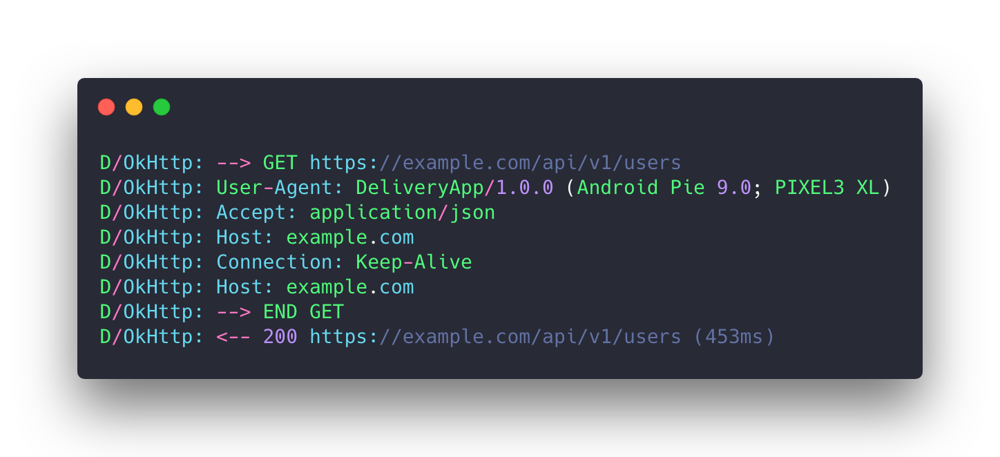

# UserAgentForAndroid [](https://jitpack.io/#cesarferreira/UserAgentForAndroid)

> Identify important app information on the `User-agent` header
<!--
<p align="center">
  
</p>
-->

<p align="center">
  
</p>

Important part:

> User-Agent: **DeliveryApp/1.0.0 (Android Pie 9.0; PIXEL3 XL)**

## Usage:

```kotlin
val userAgent = UserAgentForAndroid(
    appName = context.getString(R.string.app_name), // DeliveryApp
    appVersion = BuildConfig.VERSION_NAME           // 1.0.0
)
```

### Just add a logging interceptor

```kotlin
val loggingInterceptor = HttpLoggingInterceptor().apply {
    level = HttpLoggingInterceptor.Level.HEADERS
}
```

Add both interceptors:

```kotlin
val okHttpClient = OkHttpClient.Builder()
    .addInterceptor(loggingInterceptor)
    .addInterceptor(userAgent)
    .build()
```

### Add the `OkHttpClient` to your retrofit builder

```kotlin
val retrofit = Retrofit.Builder()
  .addCallAdapterFactory(RxJava2CallAdapterFactory.create())
  .addConverterFactory(GsonConverterFactory.create())
  .client(okHttpClient)
  .baseUrl(BASE_URL)
  .build()
```

# Extra

If you want to access any of this information:

```kotlin
DeviceInfo.getDeviceName()         // Pixel 3 XL
DeviceInfo.currentAndroidName()    // Pie
DeviceInfo.androidReleaseNumber()  // 9.0
```


# Install
Just add the following dependency in your app's `build.gradle`

```groovy
allprojects { repositories { maven { url 'https://jitpack.io' } }}
```

```groovy
dependencies {
    implementation 'com.github.cesarferreira:UserAgentForAndroid:1.0.1'
}
```


## Created by
[Cesar Ferreira](https://cesarferreira.com)

## License
MIT © [Cesar Ferreira](http://cesarferreira.com)
